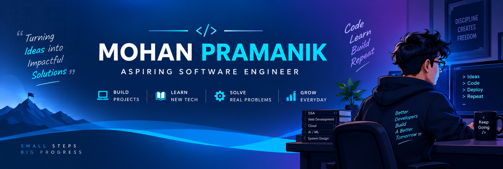

<!-- ============================================================
     Mohan Pramanik — GitHub Profile README
     Sections: 1 Hero · 2 About Me · 3 Tech Stack · 4 Featured Projects
               5 GitHub Analytics · 6 Achievements · 7 Let's Connect
     ============================================================ -->


<!-- ================= 1. HERO ================= -->
<!-- banner image -->
<p align="center">
  
</p>
<!-- two GIFs side by side, responsive: each column is 50% width so they scale together on any screen -->
<table align="center" width="100%">
  <tr>
    <td align="center" width="50%">
      
    </td>
    <td align="center" width="50%">
      
    </td>
  </tr>
</table>

<!-- typing role lines -->
<p align="center">
  
</p>

<!-- LinkedIn / Email / live project buttons -->
<p align="center">
  <a href="https://linkedin.com/in/MohanPramanik143"></a>
  <a href="mailto:mohanpramanik6294113716@gmail.com"></a>
  <a href="https://civicpulse-v2.vercel.app/"></a>
</p>

<!-- follower / profile-view counters -->
<p align="center">
  <a href="https://github.com/Mohan-Pramanik?tab=followers"></a>
  
</p>

<!-- Hidden: terminal card (assets/terminal.svg). Remove this comment wrapper to show it again.
<p align="center">
  
</p>
-->


<!-- ================= 2. ABOUT ME ================= -->
<p align="center">
  
</p>

<!-- intro paragraph -->
<p align="center">
  I'm a <b>B.Tech Information Technology</b> student at <b>Techno Main Salt Lake</b> who enjoys turning ideas into working software. I'm building full-stack <b>web applications</b> with a strong <b>backend</b> focus, sharpening my <b>problem-solving</b> fundamentals, and exploring <b>artificial intelligence</b>. I learn best by shipping <b>real-world projects</b> and improving them one iteration at a time.
</p>

<!-- education / interests / mission -->
<table align="center">
  <tr>
    <td><b>🎓 Education</b></td>
    <td>B.Tech in Information Technology, Techno Main Salt Lake</td>
  </tr>
  <tr>
    <td><b>🎯 Interests</b></td>
    <td>Software Engineering • Backend • Web Development • AI • System Design</td>
  </tr>
  <tr>
    <td><b>💡 Mission</b></td>
    <td>Turning ideas into impactful solutions.</td>
  </tr>
</table>

<!-- working style -->
<p align="center">
  <sub>💡 <b>Idea</b> → 📚 <b>Learn</b> → 💻 <b>Build</b> → 🧪 <b>Test</b> → 🧠 <b>Solve</b> → 🚀 <b>Impact</b></sub>
</p>


<!-- ================= 3. TECH STACK ================= -->
<p align="center">
  
</p>

<!-- stack cards: languages / frontend / backend / database / tools -->
<table align="center" width="100%">
  <tr>
    <td align="center" width="20%">
      <br /><br />
      
    </td>
    <td align="center" width="20%">
      <br /><br />
      
    </td>
    <td align="center" width="20%">
      <br /><br />
      
    </td>
    <td align="center" width="20%">
      <br /><br />
      
    </td>
    <td align="center" width="20%">
      <br /><br />
      
    </td>
  </tr>
</table>

<br />

<!-- deployment + foundations -->
<p align="center">
  
  &nbsp;
  
</p>


<!-- ================= 4. FEATURED PROJECTS ================= -->
<p align="center">
  
</p>

<!-- project: CivicPulse -->
<table width="100%">
  <tr>
    <td>
      <h3>🚨 CivicPulse &nbsp;<a href="https://civicpulse-v2.vercel.app/"></a></h3>
      <p><b>Crowdsourced civic issue reporting and resolution platform.</b><br />
      <b>Problem</b> — Citizens often lack a transparent way to report and track civic problems.<br />
      <b>Solution</b> — A platform where citizens report issues and departments manage resolution.</p>
      <p>
        
        
        
        
        
        
      </p>
      <p><b>Key features</b> — Issue reporting • Photo upload • Location • Interactive map • Admin dashboard • Department management • Field officer workflow • Analytics • SOS • Status tracking<br />
      <b>Status</b> — Deployed on Vercel</p>
    </td>
  </tr>
</table>

<!-- Hidden: CivicPulse architecture diagram. Remove this comment wrapper to show it again.
<details>
<summary><b>🏗️ CivicPulse architecture</b></summary>

```text
        Citizen
           │
           ▼
    React Frontend
  (React Leaflet + OSM)
           │
           ▼
      Express API
           │
           ▼
        MongoDB
           │
           ├── Admin
           ├── Department
           └── Field Officer
```

</details>
-->

<!-- project: Currency Converter -->
<table width="100%">
  <tr>
    <td valign="top">
      <h3>💱 Currency Converter</h3>
      <p>Currency conversion web application.</p>
      <p>  </p>
      <p>Built with vanilla JavaScript and an exchange-rate API.</p>
    </td>
  </tr>
</table>


<!-- ================= 5. GITHUB ANALYTICS ================= -->
<p align="center">
  
</p>

<!-- contribution streak -->
<p align="center">
  
</p>

<!-- contribution snake (needs .github/workflows/snake.yml + output branch) -->
<p align="center">
  <picture>
    <source media="(prefers-color-scheme: light)" srcset="https://raw.githubusercontent.com/Mohan-Pramanik/Mohan-Pramanik/output/github-contribution-grid-snake.svg" />
    
  </picture>
</p>


<!-- ================= 6. ACHIEVEMENTS ================= -->
<p align="center">
  
</p>

<p align="center">
  
  
  
  
  
</p>


<!-- ================= 7. LET'S CONNECT ================= -->
<p align="center">
  
</p>

<!-- contact buttons -->
<p align="center">
  <a href="https://github.com/Mohan-Pramanik"></a>
  <a href="https://linkedin.com/in/MohanPramanik143"></a>
  <a href="mailto:mohanpramanik6294113716@gmail.com"></a>
</p>

<p align="center"><sub>mohanpramanik6294113716@gmail.com</sub></p>

<!-- closing typing line -->
<p align="center">
  
</p>

<p align="center"><i>Build better. Solve smarter. Grow continuously.</i></p>

<!-- footer wave -->
<p align="center">
  
</p>
